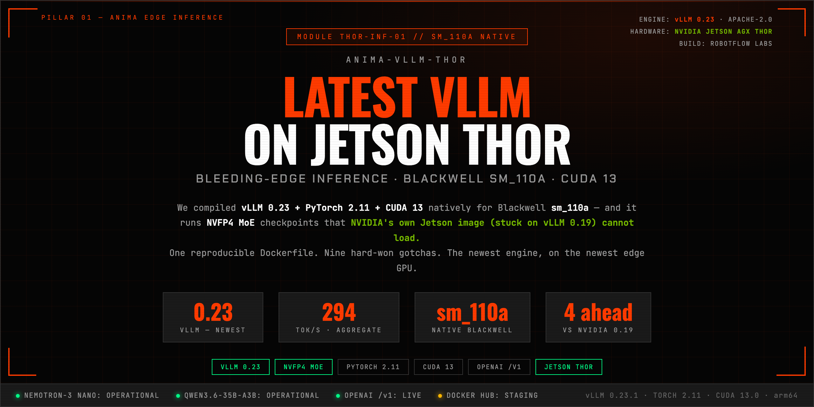
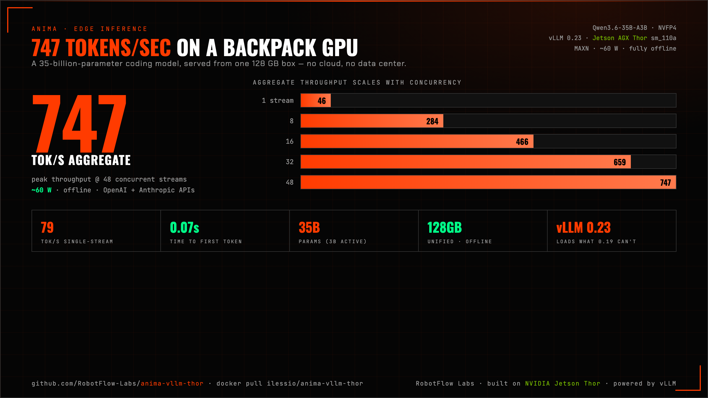

<p align="center">
  
</p>

<h1 align="center">ANIMA&nbsp;vLLM&nbsp;Thor</h1>
<p align="center"><b>The latest vLLM (0.23), compiled natively for the NVIDIA Jetson AGX Thor — running models NVIDIA's own image can't load.</b></p>

<p align="center">
  
  
  
  
</p>
<p align="center">
  
  
  
  
  
</p>
<p align="center">
  <b><a href="docs/PERFORMANCE.md">📊 Benchmarks</a> · <a href="docs/MODELS.md">🧩 Model compatibility</a> · <a href="ui">🎛 Control UI</a> · <a href="https://hub.docker.com/r/ilessio/anima-vllm-thor">🐳 Docker Hub</a></b>
</p>

---

> **TL;DR** — As of June 2026 there is **no prebuilt latest-vLLM image for the Jetson Thor.** NVIDIA's
> `ghcr.io/nvidia-ai-iot/vllm:latest-jetson-thor` ships **vLLM 0.19.0**, which **cannot load** modern NVFP4
> MoE checkpoints like `nvidia/Qwen3.6-35B-A3B-NVFP4`. This repo is a **single reproducible Dockerfile** that
> upgrades the whole stack to **vLLM 0.23 + PyTorch 2.11 + CUDA 13**, compiled natively for Blackwell
> `sm_110a` — so those models load and run on the GPU at **79 tok/s single-stream / 294 aggregate.**

## ⚡ Head to head

| | NVIDIA `vllm:latest-jetson-thor` | **`anima-vllm-thor` (this repo)** |
|---|:---:|:---:|
| vLLM version | `0.19.0` | **`0.23.1`** — 4 minor releases newer |
| PyTorch / CUDA | 2.10 / 13.0 | **2.11 / 13.0** |
| `sm_110a` native kernels | ✅ | ✅ (verified — `scripts/verify_sm110.py`) |
| Load Nemotron-3-Nano NVFP4 | ✅ 68 tok/s | ✅ **67.7 tok/s** (no regression) |
| Load **Qwen3.6-35B-A3B-NVFP4** | ❌ `KeyError: w2_input_scale` | ✅ **79.4 tok/s / 294 agg** |
| Reproducible from source | — | ✅ one `Dockerfile`, 9 gotchas documented |

<sub>NVIDIA's image is excellent and is the *base* we build on — we just don't wait for the next tag. The newest engine, on the newest edge GPU, today.</sub>

## ✨ What you get
- **vLLM 0.23.1** · **PyTorch 2.11.0+cu130** · **CUDA 13.0** · **flashinfer** · arm64 / SBSA
- Native `sm_110a` kernels — verified with a real GPU matmul (`scripts/verify_sm110.py`)
- Loads the **NVFP4 MoE** models the 0.19 image can't: Nemotron-3 (Nano / Super), **Qwen3.6-35B-A3B-NVFP4**
- `TRITON_ATTN` attention (the reliable backend for NVFP4 MoE on `sm_110`)
- OpenAI-compatible `/v1` server, fp8 KV-cache, 200K-context capable
- One self-contained `Dockerfile` + helper scripts (`serve.sh`, `bench_openai.py`, `verify_sm110.py`)

## 🚀 Quick start (on a Jetson AGX Thor)
```bash
docker pull ilessio/anima-vllm-thor:thor-sm110-vllm0.23      # linux/arm64, Thor only

docker run --rm -it --runtime nvidia --network host --shm-size=16g \
  --ulimit memlock=-1 --ulimit stack=67108864 \
  -e VLLM_USE_FLASHINFER_MOE_FP4=0 \
  -v $HOME/.cache/huggingface:/root/.cache/huggingface \
  -v $HOME/.cache/vllm:/root/.cache/vllm \
  ilessio/anima-vllm-thor:thor-sm110-vllm0.23 \
  vllm serve nvidia/Qwen3.6-35B-A3B-NVFP4 \
    --trust-remote-code --attention-backend TRITON_ATTN \
    --gpu-memory-utilization 0.7 --kv-cache-dtype fp8 \
    --max-model-len 32768 --port 8000
```
> Use `--runtime nvidia` (not `--gpus all`) on Jetson. First start JIT-compiles flashinfer (~30–60 s) — cached after.

## 📊 Benchmarks
<p align="center"></p>

<sub>Jetson AGX Thor · `sm_110a` · MAXN ~60 W · vLLM 0.23.1 · fp8 KV · `scripts/bench_openai.py` (2026-06-18)</sub>

**Qwen3.6-35B-A3B-NVFP4 on one 60 W box:** **79 tok/s** to a single user, scaling to **747 tok/s aggregate**
at 48 concurrent streams (prefix-caching + batch). Full curve, both profiles, and the honest framing
(bandwidth ceiling, what helped / didn't) in **[`docs/PERFORMANCE.md`](docs/PERFORMANCE.md)**.

| Model | quant | single-stream | aggregate | TTFT | note |
|---|---|:---:|:---:|:---:|---|
| **Qwen3.6-35B-A3B** | NVFP4 | **79 tok/s** | **747 tok/s** (peak @48) | 0.07 s | **0.19 cannot load this** — the whole point |
| Nemotron-3-Nano-30B-A3B | NVFP4 | 67.7 tok/s | 240 (@8) | 0.09 s | matches 0.19 → no regression |

Decode is **memory-bandwidth-bound** (273 GB/s ÷ ~3 B active params ≈ the single-stream ceiling); continuous
batching multiplies *total* throughput to **747 tok/s**. Big context is ~free above 100K (KV is reserved, not read).

<details>
<summary><b>Speculative decoding — the honest result (click)</b></summary>

We tested both spec-decode levers and **both *reduced* general-prompt throughput**: ngram **39 tok/s**, MTP
**50 tok/s**, vs the **79.4** no-spec baseline. Draft+verify overhead exceeds the acceptance gain here, and
the faster fused-MoE-FP4 path can't help — vLLM's `flashinfer_cutlass` / `flashinfer_cutedsl` MoE kernels are
**hard-gated to SM100 and explicitly refuse `sm_110`** (`NvFp4 MoE backend does not support current device`),
so Thor falls back to the Marlin GEMM. Spec-decode may still win on **decode-heavy / high-repetition (code)**
workloads — but for general use on Thor, **no spec-decode (79 / 294) is the best config.** Measure for *your*
workload before enabling it.
</details>

## 🧩 The 9 gotchas that make this build work
*(all encoded in the [`Dockerfile`](./Dockerfile) — this is the hard part nobody else has published)*

1. **Unset `PIP_CONSTRAINT`** — the base bakes `PIP_CONSTRAINT=torch==2.10.0`; it blocks torch 2.11 with `ResolutionImpossible`. → `ENV PIP_CONSTRAINT=""`.
2. **Uninstall vLLM 0.19 *before* upgrading torch** — 0.19 pins `torch==2.10.0`. → `pip uninstall -y vllm flashinfer-*`.
3. **`torch 2.11.0+cu130` aarch64 wheel HAS `sm_110` kernels** (`download.pytorch.org/whl/cu130/`) — verified with a real CUDA matmul. No need to build PyTorch from source.
4. **Build vLLM 0.23 from source** against that torch via `use_existing_torch.py`, `TORCH_CUDA_ARCH_LIST=11.0a` (~30–50 min, 356 CUDA objects).
5. **`LD_PRELOAD` the real driver libcuda** — `_C_stable_libtorch.abi3.so` has an unresolved `cuTensorMapEncodeTiled`; preload `/usr/lib/aarch64-linux-gnu/nvidia/libcuda.so.1` (final `ENV`, runtime-only).
6. **Reset `WORKDIR /` + remove `/build`** — else the cloned source tree shadows the installed wheel (`No module named 'vllm._C'`).
7. **Upgrade `compressed-tensors` to 0.17.x** — the base's is stale (`No module named compressed_tensors.compressors.pack_quantized`).
8. **Guard the optional quant backends** (`humming`/`inc`/`fp_quant`/`torchao`/`quark`/`deepseek_v4`/`mxfp4`) — vLLM 0.23 eagerly imports *all* of them; these aren't on arm64. Wrapped in try/except by [`scripts/patch_quant.py`](./scripts/patch_quant.py). Also pin `flashinfer-python==0.6.8` (0.6.12 isn't on the arm64 index yet).
9. **Install `numba`** — required by the ngram speculative-decoding proposer.

## 🔨 Build it yourself
```bash
DOCKER_BUILDKIT=1 docker build -t anima-vllm:thor-latest -f Dockerfile .
# ~30–50 min compile (356 CUDA objects) · needs ~90 GB RAM free (don't build while serving) · MAX_JOBS=8 if OOM
```
Verify `sm_110` first (~2 min): run `scripts/verify_sm110.py` inside the image (or any torch-2.11 venv).

## 🎛 Control plane — [`ui/`](./ui) (ANIMA Thor UI)
vLLM has no web UI, so we built one — in the same skin as this repo's hero. It manages **this** engine:
pick a model + vLLM config and launch it, manage the HF model cache (download / delete), and **discover
NVFP4 models ranked for Thor** (fits-in-128 GB + estimated tok/s). **Triple-compatible APIs** — OpenAI
`/v1` (also Factory Droid), Anthropic `/v1/messages`, **Ollama** `/api/chat` — so Cursor, Open WebUI,
n8n, LangChain and the OpenAI/Anthropic SDKs all work unchanged. Auto-fit GPU util, two perf profiles,
live tok/s meter, on-device quantize→NVFP4→publish, and a **self-healing** stack (auto-restart +
auto-serve on boot). Swagger at `/docs`. No local chat, no passwords.

```bash
cd ui && cp .env.example .env   # set HF_TOKEN + HF_HOME
./run.sh                        # http://<thor>:7000
```
Details in [`ui/README.md`](./ui/README.md).

## 🖥 Target hardware / software
Jetson AGX Thor · Blackwell `sm_110a` · 128 GB unified LPDDR5X (~273 GB/s) · JetPack 7 / L4T r38.4 ·
CUDA 13.0.88 · Ubuntu 24.04 · arm64 (SBSA). Built `FROM ghcr.io/nvidia-ai-iot/vllm:latest-jetson-thor`.

## 📄 License & attribution
- **The recipe** (`Dockerfile`, `scripts/`, docs) is **Apache-2.0** — freely reusable.
- **[vLLM](https://github.com/vllm-project/vllm)** is Apache-2.0. **[PyTorch](https://github.com/pytorch/pytorch)** is BSD-3.
- This image is built **FROM** NVIDIA's base container and includes **NVIDIA CUDA** components — redistribution
  of the **prebuilt image** is subject to the [NVIDIA base-container / CUDA EULA](https://docs.nvidia.com/cuda/eula/).
  If you want the unambiguous parts, **build from the `Dockerfile`** — the recipe is the shareable contribution.
- *NVIDIA, CUDA, Jetson, and Blackwell are trademarks of NVIDIA Corporation. vLLM and PyTorch are trademarks of
  their respective projects. This is an independent community build and is not affiliated with or endorsed by NVIDIA.*

See [`NOTICE`](./NOTICE) for full attribution.

## 🙏 Credits
Built by **[RobotFlow Labs / AIFLOW LABS](https://github.com/RobotFlow-Labs)** for the **ANIMA** edge-AI stack.
Standing on the shoulders of the [vLLM](https://github.com/vllm-project/vllm) project and NVIDIA's
[`nvidia-ai-iot/vllm`](https://github.com/nvidia-ai-iot) Jetson base image. ⭐ it if it saved you a build.
